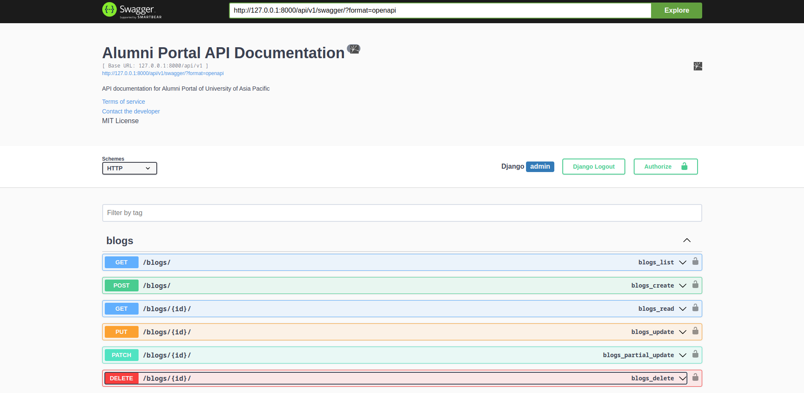

# Alumni-Portal

````markdown
# University of Asia Pacific Alumni Portal

This is the official repository for the University of Asia Pacific Alumni Portal.
The project aims to connect alumni, foster networking, and facilitate communication
between graduates and the university community.

## Project Structure

```plaintext
Alumni-Portal/
├── BACKEND/                 # Django DRF (Backend)
│   ├── CORE/                # Main Django project folder
│   │   ├── api/             # Django app for APIs
│   │   └── ...              # Other Django project files
│   ├── venv/                # Python virtual environment (not tracked by Git)
│   ├── db.sqlite3           # SQLite database (for development)
│   ├── manage.py            # Django management script
│   ├── requirements.txt     # Python dependencies
│   └── ...                  # Other backend files
├── FRONTEND/                # Next.js app (Frontend)
│   └── ...                  # Frontend files and folders
├── LICENSE                  # License information
└── README.md                # Project documentation
```
````

## Tech Stack

- **Frontend**: Next.js (React)
- **Backend**: Django REST Framework
- **Database**: SQLite (development), with plans for PostgreSQL (production)
- **Environment**: Python virtual environment, Node.js

## Getting Started

### Prerequisites

Ensure you have the following installed:

- [Python 3.x](https://www.python.org/downloads/)
- [Node.js and npm](https://nodejs.org/)
- [Git](https://git-scm.com/)

### Installation

1. **Clone the repository:**

   ```bash
   git clone https://github.com/atik65/Alumni-Portal.git
   cd Alumni-Portal
   ```

2. **Backend Setup** (Django DRF):

   - Navigate to the `BACKEND` folder:

     ```bash
     cd BACKEND
     ```

   - Create a virtual environment and activate it:

     ```bash
     python -m venv venv
     source venv/bin/activate   # On Windows, use `venv\Scripts\activate`
     ```

   - Install dependencies:

     ```bash
     pip install -r requirements.txt
     ```

   - Run migrations:

     ```bash
     python manage.py migrate
     ```

   - Start the Django development server:

     ```bash
     python manage.py runserver
     ```

3. **Frontend Setup** (Next.js):

   - Open a new terminal window, navigate to the `FRONTEND` folder:

     ```bash
     cd FRONTEND
     ```

   - Install dependencies:

     ```bash
     npm install

     OR

     yarn
     ```

   - Start the Next.js development server:

     ```bash
     npm run dev

     OR

     yarn dev
     ```

   The frontend should now be accessible at `http://localhost:3000` and the backend at `http://localhost:8000`.

## Configuration

- **Backend**: You can configure Django settings in `BACKEND/CORE/settings.py`.
- **Frontend**: Environment variables for the frontend can be managed in `FRONTEND/.env.local`.

## Usage

- **API Endpoints**: The Django REST API provides various endpoints for the alumni portal. See the [API Documentation](http://127.0.0.1:8000/api/v1/swagger/) for a detailed list of available endpoints.

```bash
http://127.0.0.1:8000/api/v1/swagger/
```

[](http://127.0.0.1:8000/api/v1/blogs/)

- **Frontend**: The Next.js app provides the user interface for alumni to connect and communicate with each other.

## **API Endpoints**

- Endpoint for `blogs` CRUD:

```bash
 http://127.0.0.1:8000/api/v1/blogs/
```

## **User Interface**

## UI Screenshots


## Contributing

1. Fork the repository.
2. Create a new branch (`git checkout -b feature/your-feature`).
3. Make your changes.
4. Commit your changes (`git commit -m 'Add some feature'`).
5. Push to the branch (`git push origin feature/your-feature`).
6. Open a pull request.

## License

This project is licensed under the MIT License. See the [LICENSE](LICENSE) file for details.

## Acknowledgments

Special thanks to the University of Asia Pacific for supporting this project.

---

**Note**: For production deployment, ensure that sensitive information is kept secure and follow best practices for environment setup, such as configuring a production-ready database and securing API endpoints.
